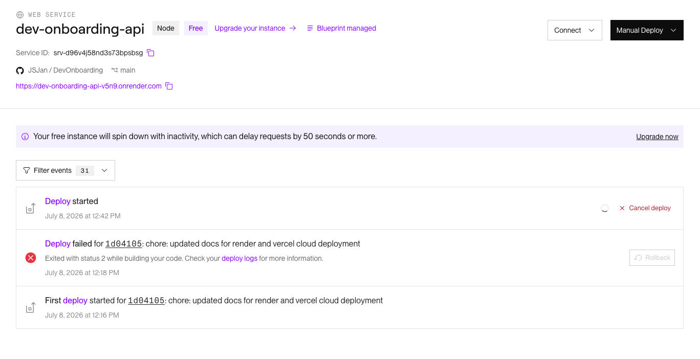

# Cloud Deployment Guide

This guide covers deploying the Dev Onboarding application to free tier cloud services:
- **Backend**: [Render](https://render.com) - Free tier with 750 hours/month
- **Frontend**: [Vercel](https://vercel.com) - Free tier for personal projects

## Prerequisites

- GitHub account with this repository pushed
- Render account (sign up at https://render.com)
- Vercel account (sign up at https://vercel.com)

---

## Part 1: Deploy Backend to Render

### Step 1: Create Render Account
1. Go to [render.com](https://render.com)
2. Sign up using your GitHub account
3. Authorize Render to access your repositories

### Step 2: Create Web Service
1. From the Render Dashboard, click **"New +"** → **"Web Service"**
2. Connect your GitHub repository
3. Configure the service:

| Setting | Value |
|---------|-------|
| **Name** | `dev-onboarding-api` |
| **Region** | Choose closest to your users |
| **Branch** | `main` |
| **Root Directory** | `backend` |
| **Runtime** | `Node` |
| **Build Command** | `npm ci && npm run build` |
| **Start Command** | `npm start` |
| **Instance Type** | `Free` |

### Step 3: Configure Environment Variables
Add these environment variables in Render dashboard:

| Variable | Value |
|----------|-------|
| `NODE_ENV` | `production` |
| `PORT` | `3001` (Render will override with its own port) |

### Step 4: Deploy
1. Click **"Create Web Service"**
2. Wait for the build to complete (first deploy takes ~5 minutes)
3. Your backend will be available at: `https://dev-onboarding-api.onrender.com`

### Important Notes for Free Tier
- Service spins down after 15 minutes of inactivity
- First request after spin-down takes ~30 seconds (cold start)
- 750 free hours per month

---

## Part 2: Deploy Frontend to Vercel

### Step 1: Create Vercel Account
1. Go to [vercel.com](https://vercel.com)
2. Sign up using your GitHub account
3. Authorize Vercel to access your repositories

### Step 2: Import Project
1. From Vercel Dashboard, click **"Add New..."** → **"Project"**
2. Select your GitHub repository
3. Configure the project:

| Setting | Value |
|---------|-------|
| **Project Name** | `dev-onboarding` |
| **Framework Preset** | `Angular` |
| **Root Directory** | `frontend` |
| **Build Command** | `npm run build -- --configuration=production` |
| **Output Directory** | `dist/dev-onboarding-frontend/browser` |
| **Install Command** | `npm ci` |

### Step 3: Configure Environment Variables
Add these environment variables in Vercel project settings:

| Variable | Value |
|----------|-------|
| `NG_APP_API_URL` | `https://dev-onboarding-api.onrender.com` |
| `NG_APP_WS_URL` | `wss://dev-onboarding-api.onrender.com` |

### Step 4: Deploy
1. Click **"Deploy"**
2. Wait for the build to complete (~2-3 minutes)
3. Your frontend will be available at: `https://dev-onboarding.vercel.app`

---

## Part 3: Connect Frontend to Backend

### Update Environment Configuration

The frontend needs to know the backend URL. Update the production environment file before deploying:

```typescript
// frontend/src/environments/environment.prod.ts
export const environment = {
  production: true,
  apiUrl: 'https://YOUR-RENDER-APP.onrender.com/api',
  wsUrl: 'wss://YOUR-RENDER-APP.onrender.com',
};
```

Replace `YOUR-RENDER-APP` with your actual Render service name.

---

## Part 4: Automatic Deployments via GitHub Actions

The CI/CD pipeline is already configured. Once you connect both services:

1. **Render**: Automatically deploys when you push to `main` branch
2. **Vercel**: Automatically deploys when you push to `main` branch

### Manual Deployment via GitHub Actions

You can also trigger deployments manually:
1. Go to **Actions** tab in your GitHub repository
2. Select **"CD - Deploy"** workflow
3. Click **"Run workflow"**
4. Choose environment (staging/production)

---

## Deployment Architecture

```
┌─────────────────────────────────────────────────────────────┐
│                        GitHub Repository                      │
│  ┌─────────────┐                         ┌─────────────┐     │
│  │   backend/  │                         │  frontend/  │     │
│  └──────┬──────┘                         └──────┬──────┘     │
└─────────┼───────────────────────────────────────┼────────────┘
          │                                       │
          │ Push to main                          │ Push to main
          ▼                                       ▼
┌─────────────────────┐               ┌─────────────────────┐
│       Render        │               │       Vercel        │
│  (Free Web Service) │               │   (Free Hosting)    │
│                     │               │                     │
│  Node.js + Fastify  │◄─────────────►│   Angular SPA       │
│  + Socket.IO        │   API Calls   │   + Static Assets   │
│  + SQLite DB        │   WebSocket   │                     │
└─────────────────────┘               └─────────────────────┘
          │                                       │
          │                                       │
          └───────────────┬───────────────────────┘
                          │
                          ▼
                    ┌───────────┐
                    │   Users   │
                    └───────────┘
```

---

## Troubleshooting

### Backend Issues

**Build fails on Render:**
- Check that `backend/package.json` has all dependencies
- Ensure TypeScript compiles without errors locally: `cd backend && npm run build`

**WebSocket not connecting:**
- Verify CORS is configured correctly
- Check that frontend uses `wss://` (not `ws://`) for production

**Database errors:**
- SQLite works on Render free tier
- Data persists between deploys but NOT between service restarts on free tier

### Frontend Issues

**Build fails on Vercel:**
- Ensure `frontend/angular.json` has correct output path
- Run `npm run build -- --configuration=production` locally first

**API calls failing:**
- Check browser console for CORS errors
- Verify `apiUrl` in environment.prod.ts matches Render URL

**Blank page after deploy:**
- Check Vercel output directory setting
- Verify `vercel.json` rewrites are correct for Angular routing

---

## Cost Summary (Free Tiers)

| Service | Free Tier Limits |
|---------|------------------|
| **Render** | 750 hours/month, auto-sleep after 15min |
| **Vercel** | 100GB bandwidth/month, unlimited deploys |

For production use, consider upgrading to paid tiers for:
- No sleep/cold starts
- Custom domains with SSL
- More compute resources
- Persistent storage

---

## Quick Reference

| Resource | URL |
|----------|-----|
| Backend API | `https://dev-onboarding-api.onrender.com` |
| Frontend App | `https://dev-onboarding.vercel.app` |
| Render Dashboard | https://dashboard.render.com |
| Vercel Dashboard | https://vercel.com/dashboard |


